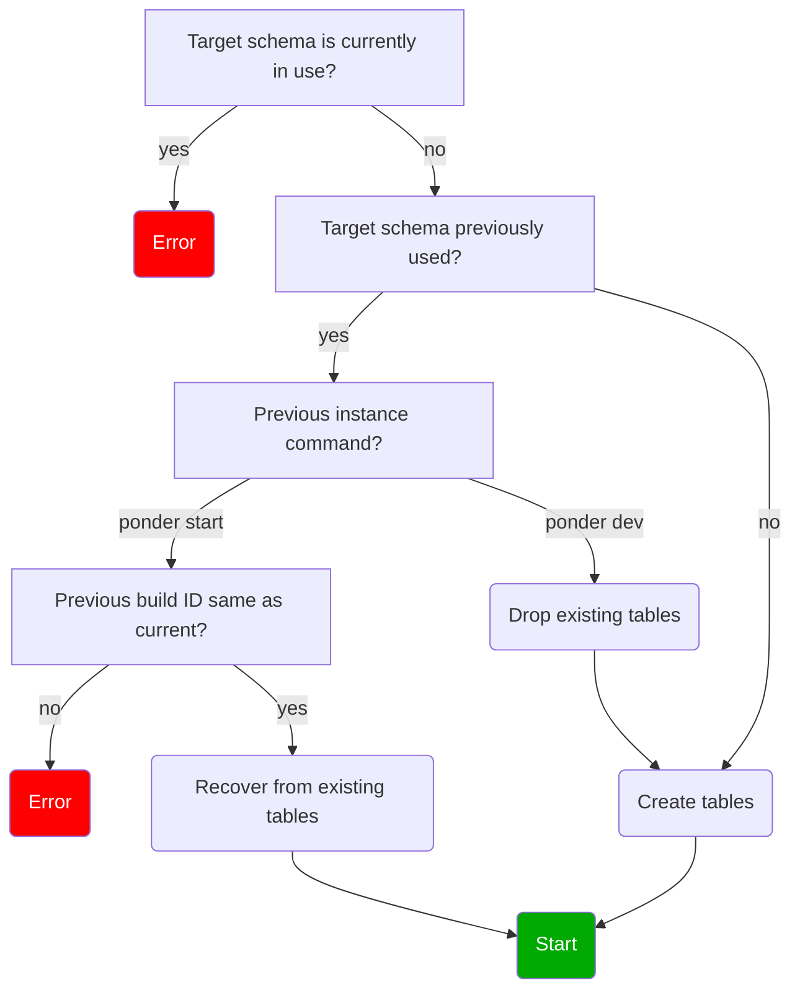

import { Steps } from "nextra/components";
import { Callout } from "nextra/components";

# Database reference

<Callout type="info">
  This is a low-level reference designed to assist with advanced workflows. To
  learn how to query indexed data, visit the [query the
  database](/docs/query/direct-sql) guide.
</Callout>

This reference documents the Ponder instance lifecycle, which may be useful for advanced workflows around zero-downtime deployments, crash recovery, and database administration.

## Instance lifecycle

Here is a high-level overview of the Ponder instance lifecycle. Note that "instance" here refers to a Node.js process running `ponder dev` or `ponder start`.

1. Start returning `200` from the `/health` endpoint. Return `503` from the `/ready` endpoint.
2. Build all user code (config, schema, indexing functions), then generate a `build_id` by hashing the build artifacts.
3. Follow the database schema flow chart below to validate and prepare the target database schema.
4. Begin historical indexing, either from scratch or from where the previous instance left off (crash recovery).
5. When historical indexing is complete, start returning `200` from the `/ready` endpoint.
6. On shutdown (e.g. due to a process exit signal), release the lock on the target schema. Do not drop any tables.

### Database schema rules

- No two instances can use the same database schema at the same time. This prevents data corruption.
- Once an instance running `ponder start` uses a schema, no other instance can use that schema – even after the instance stops. This is a safety mechanism to prevent data loss in production.
- If the target schema was previously used by `ponder dev`, the new instance will drop the previous tables and start successfully.

Here is the detailed flow chart.

### Lock / metadata table

The `_ponder_meta` table tracks the state of an instance running in a specific database schema. It stores the `build_id`, indexing checkpoint, and table names of the current instance, and uses a heartbeat locking mechanism to support the lifecycle logic described above.

### Build ID and crash recovery

During the build step, each instance generates a content hash of the entire app (config, schema, and indexing function file contents). This is called the `build_id`.

Note that crash recovery is disabled when running `ponder dev`.

## RPC request cache

Ponder caches RPC request data to improve reindexing performance on hot reloads and redeployments. This includes logs, blocks, transactions, traces, and any RPC requests made with `context.client`.

- The RPC request cache is located in the `ponder_sync` schema.
- The cache is durable, persists across instance restarts, and does not store unfinalized data.
- The cache query patterns are lock-free. It's safe for multiple instances to run in the same Postgres database at the same time (reading and writing to the same `ponder_sync` schema).
