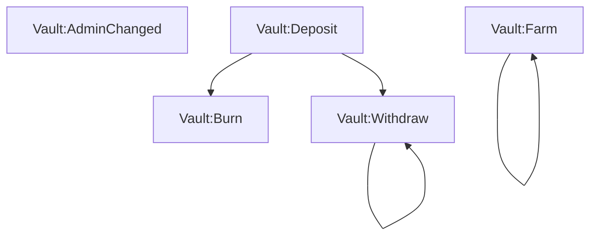

import { Callout, FileTree, Steps } from "nextra/components";

# Caching and concurrency 🚧

<Callout type="error">
  **Note:** As of `0.4.0`, Ponder no longer runs indexing functions concurrently, and caches indexing progress in fewer scenarios. This guide is only applicable for apps using `0.3.x`. We intend to reintroduce concurrent indexing in a follow-up release.
</Callout>

Ponder's indexing engine caches progress and runs concurrently when possible. This guide explains the key concepts, and offers tips for getting the most out of these features in your app.

## Caching

Starting with version `0.3`, Ponder caches indexing progress whenever possible. On a hot reload or redeploy, indexing resumes from where it left off rather than starting from scratch.

### How it works

During the build step, Ponder generates a unique cache key for each indexing function in your app.

Once the app is running and healthy, Ponder occasionally copies (finalized) indexed data from the live tables to the cache. The cache tables reside in the `ponder_cache` schema (Postgres) or `ponder_cache.db` database (SQLite).

On subsequent hot reloads or redeployments using the same database, Ponder copies any usable data from the cache to the live tables and resumes indexing from there.

### Cache keys

During the build step, Ponder generates a cache key for each indexing function. The key is (roughly) a content hash of these components:

1. Indexing function AST, including resolution of any helper functions within `src/`
2. Contract configuration (address, ABI, start block, etc)
3. Column definitions of any tables that the function writes to
4. Cache keys of any indexing functions that this one depends on

If any of these values change, the cache key changes and indexing must start from the beginning.

## Concurrency

Starting with version `0.2`, Ponder runs indexing functions concurrently when possible. This can improve indexing performance significantly, especially for apps with many isolated indexing functions.

### How it works

During the build step, Ponder generates a dependency graph for the indexing functions in your app. The graph specifies which functions can run concurrently and which must be processed sequentially. Consider this example:

- `"Vault:AdminChanged"{:ts}` has no dependencies. These events can be processed concurrently with each other and with any other events.
- `"Vault:Farm"{:ts}` depends on itself. Events must run sequentially, but can run concurrently with any other events.
- `"Vault:Deposit"{:ts}` has no dependencies, just like `"Vault:AdminChanged"{:ts}`.
- `"Vault:Burn"{:ts}` depends on `"Vault:Deposit"{:ts}`. These events must run sequentially (depends on itself) and can only be processed after `"Vault:Deposit"{:ts}` events have been processed for a given block range.
- `"Vault:Withdraw"{:ts}` works just like `"Vault:Burn"{:ts}`, but events must run sequentially.

Ponder's indexing engine uses the dependency graph to process events as soon as their dependencies are satisfied.

### Dependency rules

The nodes of the graph are indexing functions, and the edges are constructed based on which tables each function reads from and writes to.

For example, if function A writes to a table and function B reads from the same table, then function B depends on function A. If function A reads and writes to a table, then function A depends on itself.

Here's a reference for the dependency rules of each store API method:

| Store method |             |
| :----------- | :---------- |
| `create`     | Write       |
| `createMany` | Write       |
| `update`     | Read, Write |
| `updateMany` | Read, Write |
| `findUnique` | Read        |
| `findMany`   | Read        |
| `upsert`     | Read, Write |
| `delete`     | Read, Write |
