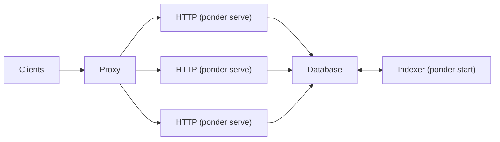

import { Steps } from "nextra/components";
import { Callout } from "nextra/components";

# Horizontal scaling

By default, Ponder runs the sync engine, indexing engine, and HTTP server (GraphQL and API functions) in the same Node.js process. This works well for small apps, but can lead to performance issues as your app grows.

If the HTTP server experiences high request volume, it contends with the indexing services for CPU and memory resources on the host, which can lead to degraded indexing performance.

To solve this, you can use the `ponder serve` command to horizontally scale the HTTP service. `ponder serve` is similar to `ponder start`, but only runs the HTTP server. It doesn't run the indexing or sync engines.

<Callout type="info">
  At this time, `ponder serve` only works with Postgres. PGlite is not
  supported.
</Callout>

## Railway Replicas

Railway makes it easy to horizontally scale `ponder serve` instances using their [Replicas](https://docs.railway.app/reference/scaling#horizontal-scaling-with-replicas) feature. This feature uses Railway's proxy to distribute incoming requests across multiple instances of your service using a round-robin strategy.

<Steps>

### Create a new service for `ponder serve`

Other than the start command, the `ponder serve` service should have the same config as the original `ponder start` service. From your project dashboard:

1. Click **New** → **GitHub repo** and select your Ponder repo from the list.
2. Open the **Settings** tab for the new service and update the **Start Command** to `ponder serve`.
3. Open the **Variables** tab, click on **New Variable** → **Add Reference** and select `DATABASE_URL`. Be sure to use the same database as the `ponder start` service.
4. [set schema]
5. Set a healthcheck path. On the **Settings** tab, go to **Deploy** → **Healthcheck Path** and enter `/health`.

### Create replicas

Once the new service is deployed and healthy, go the **Settings** tab and set the **Replicas** count to 2 or more.

### Direct traffic to `ponder serve`

Update any clients of this Ponder app to send API requests to the public domain of the new `ponder serve` service. If you're using a custom domain, you can simply update that to point to the `ponder serve` service.

### Remove public domain from the `ponder start` service

Now that the replicated `ponder serve` service is handling all incoming requests, you can remove the public URL for the original service running `ponder serve`.

</Steps>

## Other cloud environments

Ponder has not been thoroughly tested on cloud providers other than Railway. However, Ponder apps should work in any environment that supports Node.js and can connect to a Postgres database.
