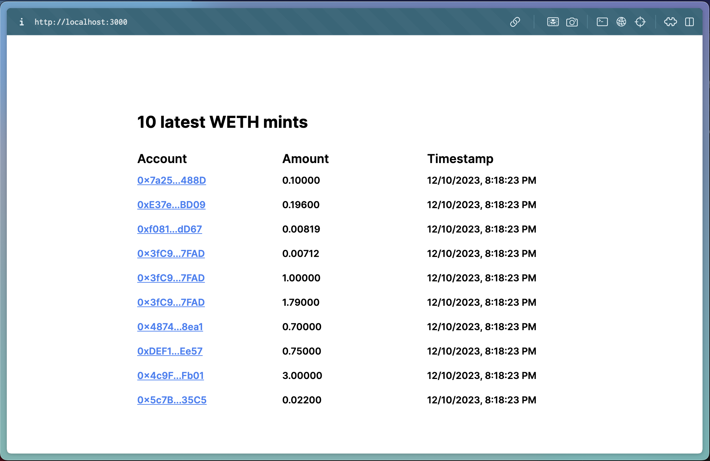

# Ponder with Next.js

This example shows how to use Ponder in a monorepo alongside a Next.js app.

The Ponder app indexes WETH Deposit events on mainnet.

## Run this example

To run this project:

1. In the `ponder` directory, copy `.env.example` to `.env.local` and add a mainnet RPC URL.
2. Run the dev script in the `ponder` directory and the `frontend` directory (`npm run dev`)

Now, the Next.js app should display and refresh data from the Ponder GraphQL API.
